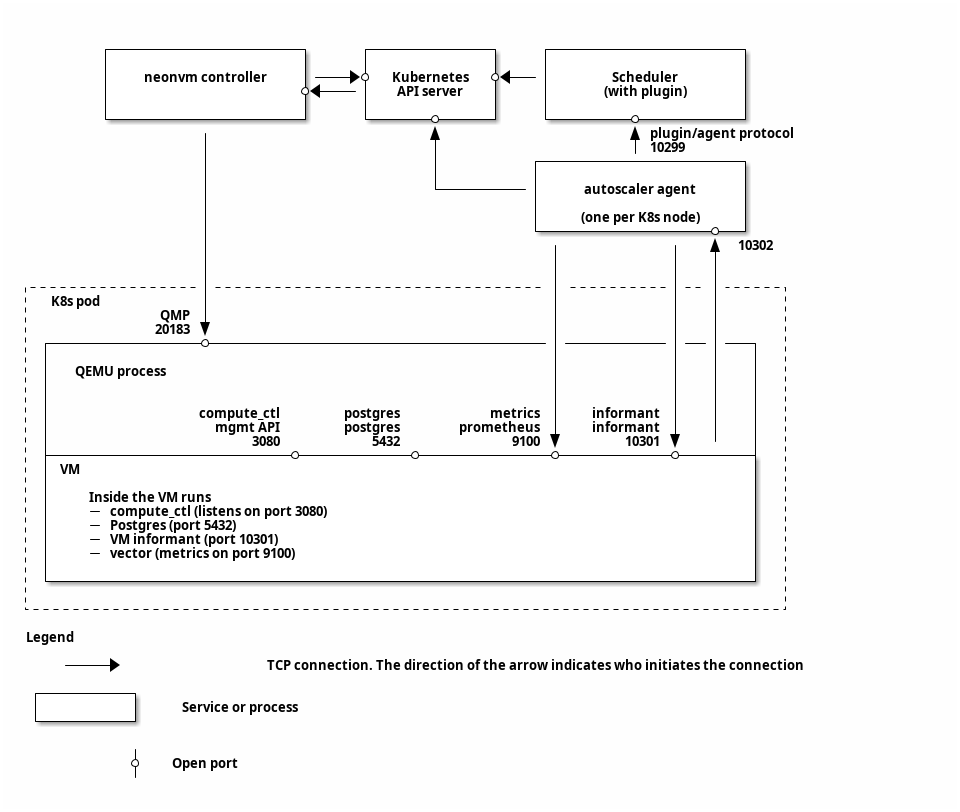

# Autoscaling: Architecture

The goal of this document is to keep a consistent overview of how the components of our autoscaling
setup fit together. Any protocol details are also written here as well.

We also briefly touch on the implementation of [NeonVM](https://github.com/neondatabase/autoscaling/tree/main/neonvm),
because it's relevant to the inter-node communication that goes on.

This document should be up-to-date. If it isn't, that's a mistake (open an issue!).

**Table of contents:**

* [See also](#see-also)
* [High-level overview](#high-level-overview)
* [Network connections between components](#network-connections-between-components)
* [Repository structure](#repository-structure)
* [Agent-Scheduler protocol details](#agent-scheduler-protocol-details)
  * [Agent-Scheduler protocol steps](#agent-scheduler-protocol-steps)
  * [Node pressure and watermarks](#node-pressure-and-watermarks)
* [High-level consequences of the Agent-Scheduler protocol](#high-level-consequences-of-the-agent-scheduler-protocol)
* [Agent-Monitor protocol details](#agent-monitor-protocol-details)
* [Footguns](#footguns)

## See also

This isn't the only architecture document. You may also want to look at:

* [`pkg/agent/ARCHITECTURE.md`](pkg/agent/ARCHITECTURE.md) — detail on the implementation of the
    autoscaler-agent
* [`pkg/plugin/ARCHITECTURE.md`](pkg/plugin/ARCHITECTURE.md) — detail on the implementation of the
  scheduler plugin
* [`neondatabase/neon/.../vm_monitor`] (a different repo) — where the vm-monitor, an autoscaling
  component running _inside_ each VM lives.

[`neondatabase/neon/.../vm_monitor`]: https://github.com/neondatabase/neon/tree/main/libs/vm_monitor

## High-level overview

At a high level, this repository provides five components with a non-trivial amount of code:

1. A Kubernetes custom resource definition (CRD) and controller (`neonvm-controller`) for managing
   resizeable VMs — NeonVM.
2. The underlying NeonVM pods run `neonvm-runner`
3. NeonVM virtual machine images are built with `vm-builder`
4. A modified Kubernetes scheduler (using the [plugin interface]) — known as "the (scheduler)
   plugin", `AutoscaleEnforcer`, `autoscale-scheduler`
5. A daemonset responsible for making VM scaling decisions & checking with interested parties
   — known as `autoscaler-agent` or simply `agent`

One last component, a binary running inside of the VM to (a) handle being upscaled
(b) validate that downscaling is ok, and (c) request immediate upscaling due to sharp changes in demand
— known as "the (VM) monitor", lives in [`neondatabase/neon/.../vm-monitor`].

[plugin interface]: https://kubernetes.io/docs/concepts/scheduling-eviction/scheduling-framework/

For information on NeonVM, see [README-NeonVM.md](./README-NeonVM.md).

The scheduler plugin is responsible for handling resource requests from the `autoscaler-agent`,
capping increases so that node resources aren't overcommitted.

The `autoscaler-agent` periodically reads from a metrics source in the VM (currently vector's
`node_exporter`-like functionality) and makes scaling decisions about the _desired_ resource
allocation. It then requests these resources from the scheduler plugin, and submits a patch request
for its NeonVM to update the resources.

The VM monitor is responsible for handling all of the resource management functionality inside
the VM that the `autoscaler-agent` cannot. This constitutes handling upscales (eg. increasing Postgres
file cache size), approving attempts to downscale resource usage (or: rejecting them, if those
resources are still in use), and requesting upscale when memory usage increases too rapidly for
metrics to catch.

NeonVM is able to live-scale the resources given to a VM (i.e. CPU and memory _slots_) by handling
patches to the Kubernetes VM object, which requires connecting to QEMU running on the outer
container.

Scaling decisions use _compute units_, which ensures that the relationship between allocated CPU and
memory is roughly linear. In practice, it's possible for this to become slightly off. This is
discussed more in the [high-level consequences] section below.

[high-level consequences]: #high-level-consequences-of-the-agent-scheduler-protocol

## Network connections between components


[Diagram source](ARCHITECTURE-network-diagram.org)

## Repository structure

At a high level, each component gets its own directory and resulting YAML for its deployment, where
applicable.

These are:

* `autoscale-scheduler` — the scheduler (with our plugin)
* `autoscaler-agent`
* `cluster-autoscaler` — patch for building a NeonVM-compatible [cluster-autoscaler]
* `neonvm` — CRDs and other related YAMLs for NeonVM, alongside Go definitions and a generated
    client. Note that the generated YAML includes a dependency on `neonvm-controller` via a webhook
    for create/update/delete operations on the CRDs.
* `neonvm-controller` — controller for the NeonVM CRDs
* `neonvm-kernel` — files relating to the virtual machine kernel we use in NeonVM
* `neonvm-runner` — per-VM management process, created by `neonvm-controller`
* `neonvm-vxlan-controller`
* `vm-builder` — binary for building VM images for use by NeonVM

[cluster-autoscaler]: https://github.com/kubernetes/autoscaler/tree/master/cluster-autoscaler

Each component directory contains:

* `cmd/` — the entrypoint of the component, containing `main.go`
* `Dockerfile` — for building the component, if applicable
* `kustomize.yaml` — if the component is separately deployed, instructions for how Kustomize should
    generate the YAML
* `*.yaml` — if the component is separately deployed, there will be other YAML files as the
    resources for Kustomize to include -- e.g. `daemonset.yaml` or `config_map.yaml`.

### Other directories

* `k3d/` and `kind/` — configuration for local test clusters
* `pkg/` — the bulk of the Go codebase. For more complex components, `cmd/main.go` often just calls
    the relevant entrypoint function in its `pkg/` directory. `pkg/` also includes the common
    packages shared by multiple components.
* `scripts` — a collection of scripts for common tasks
* `tests` — end-to-end tests
    * `tests/e2e` — [`kuttl`](https://kuttl.dev/) test scenarios itself
* `vm-examples/` — collection of VMs:
    * `pg16-disk-test/` — VM with Postgres 16 and and ssh access
      * Refer to [`vm-examples/pg16-disk-test/README.md`](./vm-examples/pg16-disk-test)  for more information.

## Agent-Scheduler protocol details

Broadly speaking, the `autoscaler-agent` _notifies_ on decrease and _requests_ increases. This means
that the scheduler always stores the upper bound on resource usage, so we don't need to worry about
overcommitting due to racy behavior.

At present, the protocol consists entirely of HTTP POST requests by the `autoscaler-agent` to the
scheduler plugin, which serves these requests on port `10299`. Each request sent by the
`autoscaler-agent` is an `api.AgentRequest` and the scheduler plugin responds with an
`api.PluginResponse` (see: [`pkg/api/types.go`](pkg/api/types.go)).

In general, a `PluginResponse` primarily provides a `Permit`, which grants permission for the
`autoscaler-agent` to assign the VM some amount of resources. By tracking total resource allocation
on each node, the scheduler can reject a scale up request to avoid having undesired over-commit.

### Agent-Scheduler protocol steps

1. On startup (for a particular VM), the `autoscaler-agent` [connects to the VM monitor] and
   fetches some initial metrics.
2. After successfully receiving a response, the autoscaler-agent sends an `AgentRequest` with the
   metrics and current resource allocation (i.e. it does not request any scaling).
3. The scheduler's `PluginResponse` informs the autoscaler-agent of the "compute unit" CPU and
   memory slots. The permit will exactly equal the resources in the `AgentRequest`.
4. The `autoscaler-agent` repeatedly fetches metrics from the VM. For each:
    1. Calculate the new desired resource allocation, as a multiple of compute units.
       With the new ScaleRequest protocol message, the vm-monitor can specify it directly.
       With older vm-monitor versions, the agent calculates it based on the VM metrics.
    2. If reaching the desired resource allocation requires scaling any resources _down_, submit a VM patch
       request that scales those resources down, but keeps the rest the same.
       * Note: this requires submitting a Kubernetes patch request. This goes through the NeonVM
         controller, which then connects back to QEMU running outside the VM to make the change. The
         full flow is then: `autoscaler-agent` → API server → NeonVM controller → VM's QEMU.
    3. Send an `AgentRequest` with the desired resource allocation (even if it's
       the same!), the last permit agent has received, and metrics to the
       plugin. Sending the current resources as desired is useful for relieving
       pressure from denied increases. (Refer to [Node pressure and
       watermarks](#node-pressure-and-watermarks) for more)
    4. The plugin's `PluginResponse` guarantees that its `Permit` will satisfy for each resource:
       1. If the resource has scaled down, then the `Permit` is equal to the new value
       2. If the resource _wants_ to scale up, then the `Permit` is between the old and requested
          new value, inclusive.
    5. If the `PluginResponse` signals that the VM will be migrating, **exit without further patch
       requests**.
    5. If the `PluginResponse`'s permit approved any amount of increase, submit a VM patch request
       that scales those resources up.
       * This has the same connection flow as the earlier patch request.

[connects to the VM monitor]: #agent-monitor-protocol-details

### Node pressure and watermarks

<!-- Note: this topic is also discussed in pkg/plugin/ARCHITECTURE.md -->

In order to trigger migrations before we _run out_ of resources on a node, the scheduler maintains a
few _logical_ concepts. Here, we're talking about "watermarks" and "pressure".

Each node has a "watermark" for each resource — the level above which the scheduler should
_preemptively_ start migrating VMs to make room. If everything is operating smoothly, we should
never run out (which would cause us to deny requests for additional resources).

In order to make sure we don't over-correct and migrate away too many VMs, we also track the
"pressure" that a particular resource on a node is under. This is, roughly speaking, the amount of
allocation above the watermark that has been requested. It _also_ includes requests that were denied
because we ran out of room.

When a VM migration is started, the scheduler marks its current resource allocation as "pressure
accounted for", along with any pressure from denied requests for increases in the VM's resource
allocation. This pressure from requests that couldn't be satisfied is referred to as _capacity
pressure_, whereas the pressure from usage above the watermark is referred to as _logical pressure_.

The scheduler migrates VMs whenever the combination of _logical_ and _capacity_ pressure is greater
than the amount of pressure already accounted for.

## High-level consequences of the Agent-Scheduler protocol

1. If a VM is continuously migrated, it will never have a chance to scale up.
2. Because resources are handled separately, any discrepancy in external resource availability can
   cause the scheduler to return `Permit`s that aren't a clean multiple of a compute unit.
   (e.g., nodes have mismatched memory vs CPU, or external pods / system reserved are mismatched)

## Agent-Monitor protocol details

Agent-Monitor communication is carried out through a relatively simple _versioned_ protocol
over websocket. One party sends a message, the other responds. There are various
message types that each party sends, and all messages are annotated with an ID.
The allows a sender to recognize responses to its previous messages. If the
out-message has ID X, then the return message will also have ID X.

Like the other protocols, relevant types are located in [`pkg/api/types.go`].

1. On startup, the VM monitor listens for websocket connections on `127.0.0.1:10369`
2. On startup, the agent connects to the monitor via websocket on `127.0.0.1:10369/monitor`
3. The agent then sends a `VersionRange[MonitorProtocolVersion]` with the range of
   protocols it supports.
4. The monitor responds with the highest common version between the two. If there is no
   compatible protocol, it returns an error.
5. From this point on, either party may initiate a transaction by sending a Message.
6. The other party responds with the appropriate message, with the same ID attached
   so that the receiver knows it has received a response.

Currently, the following interactions are supported:
```
Monitor   sends   UpscaleRequest
Agent     returns NotifyUpscale

Agent     sends   TryDownscale
Monitor   returns DownscaleResult

Agent     sends   NotifyUpscale
Monitor   returns UpscaleConfirmation

Agent     sends   HealthCheck
Monitor   returns HealthCheck
```

*Healthchecks*: the agent initiates a health check every 5 seconds. The monitor
simply returns with an ack.

There are two additional messages types that either party may send:
- `InvalidMessage`: sent when either party fails to deserialize a message it received
- `InternalError`: used to indicate that an error occurred while processing a request,
  for example, if the monitor errors while trying to downscale

## Footguns

_An alternate name for this section:_ Things to watch out for

* Creating a pod with `PodSpec.Node` set will bypass the scheduler (even if `SchedulerName` is set),
  so we cannot prevent it from overcommitting node resources. **Do not do this except for "system"
  functions.**
* Non-VM pods will be accounted for _only_ by their `resources.requests` — this is for compatibility
  with tools like [cluster autoscaler], but allows potentially overcommitting memory. To avoid
  overcommitting in this way, set `resources.requests` equal to `resources.limits`. For more, see
  [`pkg/plugin/ARCHITECTURE.md`]

[cluster autoscaler]: https://github.com/kubernetes/autoscaler
[`pkg/plugin/ARCHITECTURE.md`]: pkg/plugin/ARCHITECTURE.md
