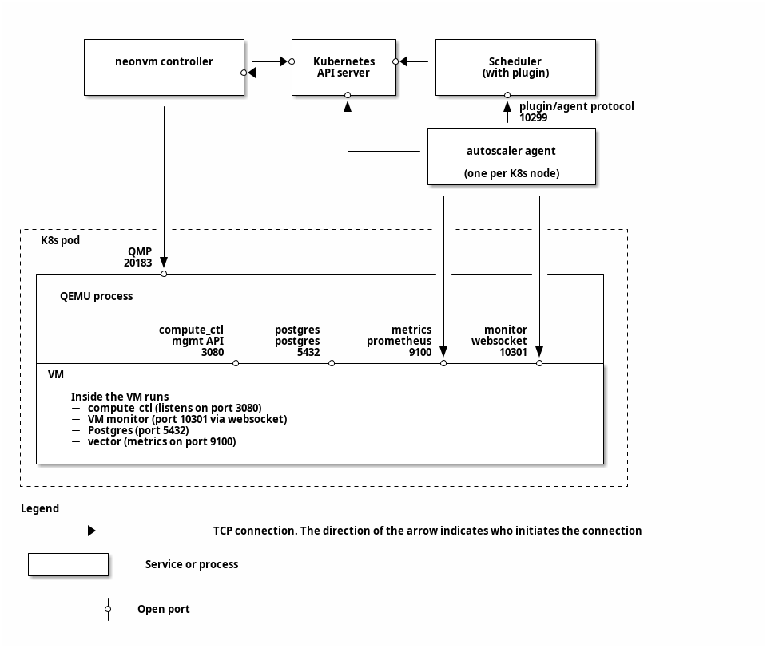

# Autoscaling: Architecture

The goal of this document is to keep a consistent overview of how the components of our autoscaling
setup fit together. Any protocol details are also written here as well.

We also briefly touch on the implementation of [NeonVM](https://github.com/neondatabase/autoscaling/tree/main/neonvm),
because it's relevant to the inter-node communication that goes on.

This document should be up-to-date. If it isn't, that's a mistake (open an issue!).

**Table of contents:**

* [See also](#see-also)
* [High-level overview](#high-level-overview)
* [Network connections between components](#network-connections-between-components)
* [Repository structure](#repository-structure)
* [Agent-Scheduler protocol details](#agent-scheduler-protocol-details)
  * [Agent-Scheduler protocol steps](#agent-scheduler-protocol-steps)
  * [Node pressure and watermarks](#node-pressure-and-watermarks)
* [High-level consequences of the Agent-Scheduler protocol](#high-level-consequences-of-the-agent-scheduler-protocol)
* [Agent-Informant protocol details](#agent-informant-protocol-details)
* [Footguns](#footguns)

## See also

This isn't the only architecture document. You may also want to look at:

* [`pkg/plugin/ARCHITECTURE.md`](pkg/plugin/ARCHITECTURE.md) — detail on the implementation of the
  scheduler plugin

## High-level overview

At a high level, this repository provides three components:

1. A modified Kubernetes scheduler (using the [plugin interface]) — known as "the (scheduler)
   plugin", `AutoscaleEnforcer`, `autoscale-scheduler`
2. A daemonset responsible for making VM scaling decisions & checking with interested parties
   — known as `autoscaler-agent` or simply `agent`
3. A binary running inside of the VM to (a) provide metrics to the `autoscaler-agent`, (b) validate
   that downscaling is ok, and (c) request immediate upscaling due to sharp changes in demand —
   known as "the (VM) informant"

[plugin interface]: https://kubernetes.io/docs/concepts/scheduling-eviction/scheduling-framework/

The scheduler plugin is responsible for handling resource requests from the `autoscaler-agent`,
capping increases so that node resources aren't overcommitted.

The `autoscaler-agent` periodically reads from a metrics source in the VM (defined by the
_informant_) and makes scaling decisions about the _desired_ resource allocation. It then
requests these resources from the scheduler plugin, and submits a patch request for its NeonVM to
update the resources.

The VM informant provides is responsible for handling all of the functionality inside the VM that
the `autoscaler-agent` cannot. It provides metrics (or: informs the agent where it can find those)
and approves attempts to downscale resource usage (or: rejects them, if they're still in use).

NeonVM is able to live-scale the resources given to a VM (i.e. CPU and memory _slots_) by handling
patches to the Kubernetes VM object, which requires connecting to QEMU running on the outer
container.

Scaling decisions use _compute units_, which ensures that the relationship between allocated CPU and
memory is roughly linear. In practice, it's possible for this to become slightly off. This is
discussed more in the [high-level consequences] section below.

[high-level consequences]: #high-level-consequences-of-the-agent-scheduler-protocol

## Network connections between components

[Diagram source](ARCHITECTURE-network-diagram.org)

## Repository structure

* `build/` — scripts for building the scheduler (`autoscale-scheduler`) and `autoscaler-agent`
* `cluster-autoscaler/` — patch and Dockerfile for building a NeonVM-compatible [cluster-autoscaler]
* `cmd/` — entrypoints for the `autoscaler-agent`, VM informant, and scheduler plugin. Very little
    functionality implemented here. (See: `pkg/agent`, `pkg/informant`, and `pkg/plugin`)
* `deploy/` — YAML files used during cluster init. Of these, only the following two are manually
  written:
    * `deploy/autoscaler-agent.yaml`
    * `deploy/autoscale-scheduler.yaml`
* `kind/` — files specific to creating our [kind](https://kind.sigs.k8s.io/) cluster
    * `kind/config.yaml` — configuration for the kind cluster
* `neonvm/` — QEMU-based virtualisation API and controllers for k8s
   * See [`neonvm/README.md`](./neonvm/README.md) for details
* `pkg/` — core go code from the scheduler plugin and `autoscaler-agent`. Where applicable, the
  purpose of individual files is commented at the top.
    * `pkg/agent/` — implementation of `autoscaler-agent`
    * `pkg/api/` — all types for inter-component communications, plus some protocol-relevant types
        independently used by multiple components.
    * `pkg/billing/` — consumption metrics API, primarily used in
        [`pkg/agent/billing.go`](pkg/agent/billing.go)
    * `pkg/informant/` — implementation of the VM informant
    * `pkg/plugin/` — implementation of the scheduler plugin
    * `pkg/util/` — miscellaneous utilities that are too general to be included in `agent` or
      `plugin`.
* `scripts/` — a collection of scripts for common tasks. Items of note:
    * `scripts/patch-*.json` — patches for testing live-updating of a VM or config
    * `scripts/replace-scheduler.sh` — replaces the currently running scheduler, for quick redeploy
    * `scripts/repeat-delete-scheduler.sh` — repeatedly deletes the scheduler (which will be
        recreated by the deployment). For debugging.
    * `scripts/run-bench.sh` — starts a CPU-intensive pgbench connected to a VM. Useful to watch
      the TPS and get confirmation that autoscaled CPUs are being used.
    * `scripts/scheduler-logs.sh` — convenience script to tail the scheduler's logs
    * `scripts/ssh-into-vm.sh` — `ssh`es into a VM. Useful for debugging.
    * `scripts/start-vm-bridge.sh`
* `tests/` — end-to-end tests
    * `tests/e2e` — [`kuttl`](https://kuttl.dev/) test scenarios itself
* `scripts-common.sh` — file with a handful of useful functions, used both in `build` and `scripts`
* `vm-deploy.yaml` — sample creation of a single VM, for testing autoscaling
* `vm-examples/` — collection of VMs:
    * `pg14-disk-test/` — VM with Postgres 14 and and ssh access
      * Refer to [`vm-examples/pg14-disk-test/README.md`](./vm-examples/pg14-disk-test)  for more information.
    * `postgres-minimal/` — Minimal Postgres 15 VM used in e2e tests

[cluster-autoscaler]: https://github.com/kubernetes/autoscaler/tree/master/cluster-autoscaler

## Agent-Scheduler protocol details

Broadly speaking, the `autoscaler-agent` _notifies_ on decrease and _requests_ increases. This means
that the scheduler always stores the upper bound on resource usage, so we don't need to worry about
overcommitting due to racy behavior.

At present, the protocol consists entirely of HTTP POST requests by the `autoscaler-agent` to the
scheduler plugin, which serves these requests on port `10299`. Each request sent by the
`autoscaler-agent` is an `api.AgentRequest` and the scheduler plugin responds with an
`api.PluginResponse` (see: [`pkg/api/types.go`](pkg/api/types.go)).

In general, a `PluginResponse` primarily provides a `Permit`, which grants permission for the
`autoscaler-agent` to assign the VM some amount of resources. By tracking total resource allocation
on each node, the scheduler can prevent

### Agent-Scheduler protocol steps

1. On startup (for a particular VM), the `autoscaler-agent` [connects to the VM informant] and
   fetches some initial metrics.
2. After successfully receiving a response, the autoscaler-agent sends an `AgentRequest` with the
   metrics and current resource allocation (i.e. it does not request any scaling).
3. The scheduler's `PluginResponse` informs the autoscaler-agent of the "compute unit" CPU and
   memory slots. The permit will exactly equal the resources in the `AgentRequest`.
4. The `autoscaler-agent` repeatedly fetches metrics from the VM. For each:
    1. Calculate the new desired resource allocation, as a multiple of compute units.
    2. If reaching the desired resource allocation requires scaling any resources _down_, submit a VM patch
       request that scales those resources down, but keeps the rest the same.
       * Note: this requires submitting a Kubernetes patch request. This goes through the NeonVM
         controller, which then connects back to QEMU running outside the VM to make the change. The
         full flow is then: `autoscaler-agent` → API server → NeonVM controller → VM's QEMU.
    3. Send an `AgentRequest` with the desired resource allocation (even if it's the same!) and
       metrics to the plugin. Sending the current resources as desired is useful for relieving
       pressure from denied increases. (Refer to [Node pressure and
       watermarks](#node-pressure-and-watermarks) for more)
    4. The plugin's `PluginResponse` guarantees that its `Permit` will satisfy for each resource:
       1. If the resource has scaled down, then the `Permit` is equal to the new value
       2. If the resource _wants_ to scale up, then the `Permit` is between the old and requested
          new value, inclusive.
    5. If the `PluginResponse` signals that the VM will be migrating, **exit without further patch
       requests**.
    5. If the `PluginResponse`'s permit approved any amount of increase, submit a VM patch request
       that scales those resources up.
       * This has the same connection flow as the earlier patch request.

[connects to the VM informant]: #agent-informant-protocol-details

### Node pressure and watermarks

<!-- Note: this topic is also discussed in pkg/plugin/ARCHITECTURE.md -->

In order to trigger migrations before we _run out_ of resources on a node, the scheduler maintains a
few _logical_ concepts. Here, we're talking about "watermarks" and "pressure".

Each node has a "watermark" for each resource — the level above which the scheduler should
_preemptively_ start migrating VMs to make room. If everything is operating smoothly, we should
never run out (which would cause us to deny requests for additional resources).

In order to make sure we don't over-correct and migrate away too many VMs, we also track the
"pressure" that a particular resource on a node is under. This is, roughly speaking, the amount of
allocation above the watermark that has been requested. It _also_ includes requests that were denied
because we ran out of room.

When a VM migration is started, the scheduler marks its current resource allocation as "pressure
accounted for", along with any pressure from denied requests for increases in the VM's resource
allocation. This pressure from requests that couldn't be satisfied is referred to as _capacity
pressure_, whereas the pressure from usage above the watermark is referred to as _logical pressure_.

The scheduler migrates VMs whenever the combination of _logical_ and _capacity_ pressure is greater
than the amount of pressure already accounted for.

## High-level consequences of the Agent-Scheduler protocol

1. If a VM is continuously migrated, it will never have a chance to scale up.
2. Because resources are handled separately, any discrepancy in external resource availability can
   cause the scheduler to return `Permit`s that aren't a clean multiple of a compute unit.
   (e.g., nodes have mismatched memory vs CPU, or external pods / system reserved are mismatched)

## Agent-Informant protocol details

A brief note before we get started: There are a lot of specific difficulties around making sure that
the informant is always talking to _some_ agent — ideally the most recent one. While _in theory_
there should only ever be one, we might have `n=0` or `n>1` during rollouts of new versions. Our
process for handling this is not discussed here — this section only covers the communciations
between a single agent and informant.

The relevant types for the agent-informant protocol are all in [`pkg/api/types.go`]. If using this
as a reference, it may be helpful to have that file open at the same time.

[`pkg/api/types.go`]: ./pkg/api/types.go

It may also be worth noting that this protocol is versioned. For an overview of version
compatibility and how it relates to releases of this repository, refer to
[`pkg/api/VERSIONING.md`](./pkg/api/VERSIONING.md).

The protocol is as follows:

1. On startup, the VM informant starts an HTTP server listening on `0.0.0.0:10301`.
2. On startup for this VM, the `autoscaler-agent` starts an HTTP server listening _some_ port
3. The agent sends an `AgentDesc` to the informant as a POST request on the `/register` endpoint.
   Before responding:
    1. If the informant has already registered an agent with the same `AgentDesc.AgentID`, it
       immediately responds with HTTP code 409.
    2. If the informant's protocol version doesn't match the `AgentDesc`'s min/max protocol
       versions, it immediately responds with HTTP code 400.
    3. Using the provided `ServerAddr` from the agent's `AgentDesc`, the informant makes a GET
       request on the agent's `/id` endpoint
    4. The agent responds immediately to the `/id` request with an `AgentMessage[AgentIdentification]`.
    5. If the agent's `AgentIdentification.AgentID` doesn't match the original `AgentDesc.AgentID`,
       the informant responds with HTTP code 400.
    6. Otherwise, the informant responds with HTTP code 200, returning an `InformantDesc` describing
       its capabilities and which protocol version to use.
4. Begin "normal operation". During this, there are a few types of requests made between the agent
   and informant. Each party can make **only one request at a time**. The agent starts in the
   "suspended" state.
    1. The informant's `/health-check` endpoint (via PUT), with `AgentIdentification`. This allows
       the autoscaler-agent to check that the informant is up and running, and that it still
       recognizes the agent.
    2. The informant's `/downscale` endpoint (via PUT), with `AgentResourceMessage`. This serves as the
       agent _politely asking_ the informant to decrease resource usage to the specified amount.
       The informant returns a `DownscaleResult` indicating whether it was able to downscale (it may
       not, if e.g. memory usage is too high).
    3. The informant's `/upscale` endpoint (via PUT), with `AgentResourceMessage`. This serves as the agent
       _notifying_ the informant that its resources have increased to the provided amount.
    4. The agent's `/suspend` endpoint (via POST), with `SuspendAgent`. This allows the informant to
       inform the agent that it is no longer in use for the VM. While suspended, the agent **must
       not** make any `downscale` or `upscale` requests. The informant **must not** double-suspend
       an agent.
    5. The agent's `/resume` endpoint (via POST), with `ResumeAgent`. This allows the informant to
       pick up communication with an agent that was previously suspended. The informant **must not**
       double-resume an agent.
    6. The agent's `/id` endpoint (via GET) is also available during normal operation, and is used
       as a health check by the informant.
    7. The agent's `/try-upscale` endpoint (via POST), with `MoreResources`. This allows the
       informant to request more of a particular resource (e.g. memory). The agent MUST respond
       immediately with an `AgentIdentification`. It MAY later send an `/upscale` request to the
       informant once the requested increase in resources has been achieved.
5. If explicitly cut off, communication ends with the agent sending the original `AgentDesc` as a
   DELETE request on the `/unregister` endpoint. The informant returns an `UnregisterAgent`.

Broadly, agent<->informant connections are not expected to survive restarts of the informant (due
to failure, or otherwise). So, it is expected that *sometimes*, the informant will receive a request
for an agent that it has no connection to. When that happens, the informant MUST respond with HTTP
code 404, and the agent SHOULD try reconnecting.

## Footguns

_An alternate name for this section:_ Things to watch out for

* Creating a pod with `PodSpec.Node` set will bypass the scheduler (even if `SchedulerName` is set),
  so we cannot prevent it from overcommitting node resources. **Do not do this except for "system"
  functions.**
* Non-VM pods will be accounted for _only_ by their `resources.requests` — this is for compatibility
  with tools like [cluster autoscaler], but allows potentially overcommitting memory. To avoid
  overcommitting in this way, set `resources.requests` equal to `resources.limits`. For more, see
  [`pkg/plugin/ARCHITECTURE.md`]

[cluster autoscaler]: https://github.com/kubernetes/autoscaler
[`pkg/plugin/ARCHITECTURE.md`]: pkg/plugin/ARCHITECTURE.md
