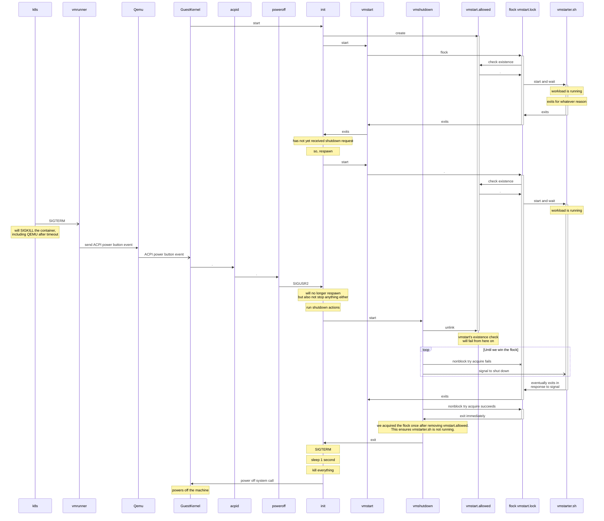

This README covers non-trivial implementation details of vm-builder.

What `vm-builder` Does
======================

vm-builder consumes a Docker image and turns it into a new docker image that runs the Docker container in a qemu VM.
The OS in the VM is a minimal Alpine Linux / busybox environment.
We use busybox `init` as the init system, configured through `/etc/inittab`.
Likewise, the `poweroff` command is provided by busybox.

We use a virtual CDROM to deliver the container launch command / entrypoint+arguments into the VM.
The script is called `vmstarter.sh`.
It is launched by the `vmstart` script which in turn is configured as a `respawn` service in the `inittab`.
After `vmstarter.sh` exits, `vmstart` exits, and then gets restarted by `respawn`.
This is a bit like docker in `--restart=always` mode.

**Graceful shutdown** of the container-turned-VM is done through a virtual ACPI power button event.
`acpid` handles the ACPI events and we configure it to call the busybox `poweroff` command.

Busybox Init & Shutdown
=======================

The busybox `poweroff` command is integrated with the busybox `init` command as follows:

0. Invoking busybox `poweroff` signals SIGUSR2 to the busybox `init` process.
   The `init` process then does the following:
1. Stop waiting for child processes to exit, and stop restarting child
   processes that are marked `respawn` in the inittab.
2. Run the `shutdown` directives in the inittab, in the order
   in which they are specified.
3. Send SIGTERM to all processes.
4. Sleep 1 second.
5. (minor details omitted)
6. Call into kernel to poweroff.

What follows are links to the busybox source code to "prove" the above.

The `poweroff` command invoked by acpid is the busybox poweroff.
At runtime, we take the following branch:
https://github.com/brgl/busybox//blob/97e9a72c71d0238c9f241612ce4af923c16954c7/init/halt.c#L172-L173
The `signals[which]` variable is `SIGUSR2` for the `poweroff` "applet".

The code in `init` that handles `SIGUSR2` is the `check_delayed_signals` function that is called form inside `init`'s main loop.
Code taken at runtime when `poweroff` signals `SIGUSR2`:

* main loop calls `check_delayed_signals`: https://github.com/brgl/busybox//blob/f35ad3bd1287627fc6ca7cc9c1f48b186257dd87/init/init.c#L1219
* check_delayed_signals detects `SIGUSR2` was signalled and calls `halt_reboot_pwoff`, this call will never return: https://github.com/brgl/busybox//blob/f35ad3bd1287627fc6ca7cc9c1f48b186257dd87/init/init.c#L996-L1005
* it calls `run_shutdown_and_kill_processes` https://github.com/brgl/busybox//blob/f35ad3bd1287627fc6ca7cc9c1f48b186257dd87/init/init.c#L821
* Runs `shutdown` actions in the inittab: https://github.com/brgl/busybox//blob/f35ad3bd1287627fc6ca7cc9c1f48b186257dd87/init/init.c#L751-L754
* SIGTERM, pause, SIGKILL (not relevant for as because we take down postgres & compute_ctl through the shutdown action added in this PR: https://github.com/brgl/busybox//blob/f35ad3bd1287627fc6ca7cc9c1f48b186257dd87/init/init.c#L758-L766
* Log shutdown and call into kernel: https://github.com/brgl/busybox//blob/f35ad3bd1287627fc6ca7cc9c1f48b186257dd87/init/init.c#L832-L833


The Role Of `vm-builder` in Neon Autoscaling
============================================

In Neon's autoscaling, we use `vm-builder` to turn the `neon.git` compute Docker image into a VM.
This means the `vmstarter.sh` will launch the `compute_ctl`, which in turn:
1. waits for a spec
2. gets basebackup from compute
3. launches Postgres
4. waits for Postgres to exit
5. does a sync safekeepers
6. exits itself.

Neon Control Plane's `suspend_compute` relies on ACPI shutdown
signalling for graceful shutdown of the NeonVM.
If the NeonVM doesn't shut down timely, the pod that contains
the qemu process gets SIGKILLed.

What Happens On ACPI Shutdown
=============================

Here is a mermaid diagram of what happens during shutdown:




## How It Looks Inside The VM

In a neon.git-compute-image-turned-vm image, running in staging, it looks like this

```
ps -eHo pid,command | cat
...
/neonvm/bin/sh /neonvm/bin/vmstart
  149     flock /neonvm/vmstart.lock -c test -e /neonvm/vmstart.allowed && /neonvm/bin/su-exec postgres /neonvm/bin/sh /neonvm/bin/vmstarter.sh
  150       /bin/sh -c test -e /neonvm/vmstart.allowed && /neonvm/bin/su-exec postgres /neonvm/bin/sh /neonvm/bin/vmstarter.sh
  151         /neonvm/bin/sh /neonvm/bin/vmstarter.sh
  152           /usr/local/bin/compute_ctl -D /var/db/postgres/compute/pgdata -b /usr/local/bin/postgres -C postgresql://cloud_admin@127.0.0.1/postgres?options=-c%20default_transaction_read_only=false --remote-ext-config {"bucket":"neon-dev-extensions-us-east-2","region":"us-east-2"} --compute-id compute-long-flower-94034268 --control-plane-uri http://neon-compute-api.aws.neon.build:9096
  178             /usr/local/bin/postgres -D /var/db/postgres/compute/pgdata
  182               postgres: checkpointer
  183               postgres: background writer
  185               postgres: walwriter
  186               postgres: autovacuum launcher
  187               postgres: pg_cron launcher
  188               postgres: TimescaleDB Background Worker Launcher
  189               postgres: WAL proposer streaming 0/1FD62B0
  190               postgres: Local free space monitor
  191               postgres: logical replication launcher
  201               postgres: cloud_admin postgres 127.0.0.1(33860) idle
  204               postgres: cloud_admin postgres ::1(53686) idle
...
```

## TLA+ Model Of Shutdown

The `./shutdown/shutdown.tla` model is a PlusCal specification of the shutdown procedure.

TLC model checker configuration:

* Check for deadlocks, there shouldn't be any.
* Check temporal properties `TEMPORAL PROPERTIES` at the bottom of the spec.
