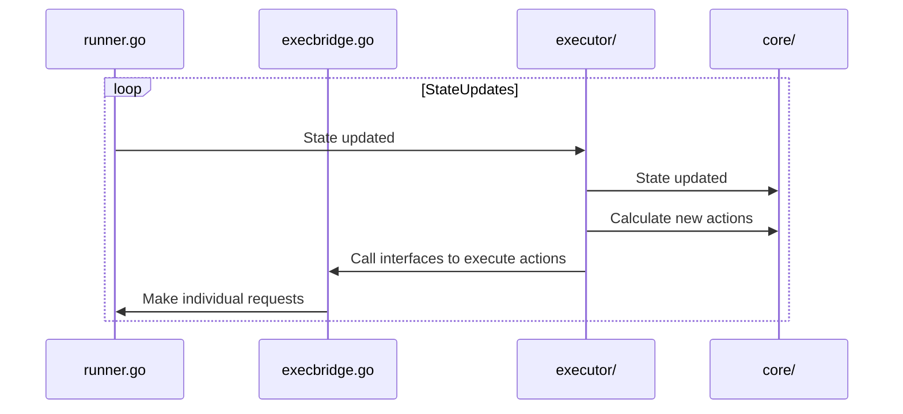

# autoscaler-agent: Architecture

The purpose of this document is to provide some context about _what_ the autoscaler-agent does,
_why_ it does that, and _how_ that's implemented internally.

This document is expected to remain up-to-date. If it isn't, that's a mistake (open an issue!).

**Table of contents:**

* [What](#what)
* [Why](#why)
* [How](#how)
  * [`agent.Runner`](#agentrunner)
  * [Scaling, end-to-end](#scaling-end-to-end)

## What

The autoscaler-agent is a k8s node daemon that is responsible for:

1. Fetching current load metrics from VMs
2. Communicating with vm-monitor running inside each VM to:
    1. Request permission for downscaling
    2. Notify about recent upscaling
    3. _Receive_ requests for "immediate upscaling" from the vm-monitor
3. Communicating with the scheduler plugin to:
    1. Request permission for upscaling
    2. Notify about recent downscaling
4. Modifying the NeonVM VirtualMachine object according to the desired scaling, based on load
   metrics and requested upscaling, if any.
5. Generating and sending billing data representing the current CPU usage from each VM.

So, in general, the idea is that the autoscaler-agent uses metrics from the VM to figure out what
the "desired" resources should be, and then:

- if scaling up, contacts: scheduler plugin → NeonVM → vm-monitor
- if scaling down, contacts: vm-monitor → NeonVM → scheduler plugin

See also: the root-level [`ARCHITECTURE.md`](../../ARCHITECTURE.md).

## Why

This section provides some historical context.

Originally, the autoscaler-agent was a sidecar container per-VM that was directly responsible for
the above communications, and only acted on behalf of that single VM.

We eventually moved the autoscaler-agent from a per-VM to per-node (i.e. k8s node), mostly wrapping
our own lifecycle handling around the existing architecture, using k8s watch events (via
`pkg/util/watch`) to get notified when VMs were started or stopped, in [#4].

[#4]: https://github.com/neondatabase/autoscaling/pull/4

Then, we needed to generate billing events based on the resource usage from these VMs.
Our options were to implement that as a new component, as part of the NeonVM controller, or within
the autoscaler-agent. We included it in the autoscaler-agent because we already had the objects
store (`pkg/util/watch.Store`) from the existing watch events, and already had it deployed. That was
implemented in `pkg/agent/billing/` in [#49].

[#49]: https://github.com/neondatabase/autoscaling/pull/49

---

Another significant change came when we switched to the vm-monitor from its predecessor,
vm-informant, which came with moving from a bi-directional REST API (with a server for each VM in
the autoscaler-agent) to a websocket connection from the autoscaler-agent to the vm-monitor.
Support for the vm-informant was removed with #506.

[#506]: https://github.com/neondatabase/autoscaling/pull/506

## How

This final section discusses the _actual_ architecture of the autoscaler-agent - what its internal
components are, and how they interact with each other.

---

At a high level, these are the components of the autoscaler-agent:

- Initial setup and main loop (`entrypoint.go`, `config.go`, and `args.go`), called by
  `cmd/autoscaler-agent/main.go`.
  - Receives events from the VM event watcher (`watch.go`)
  - Updates the "global state" (`globalstate.go`)
- Per-VM communication and scaling logic (`runner.go`)
  - Tracks the current scheduler to communicate with (`schedwatch/trackcurrent.go`)
  - Communication with vm-monitor managed by (`dispatcher.go`)
  - Pure scaling logic state machine implemented in `core/`
    - "Execution" of the state machine's recommendations in `executor/`
    - Implementations of the executor's interfaces in `execbridge.go`
- Billing events collection (`billing/billing.go`) and sending (`billing/send.go`),
  using the VM watcher.
- Prometheus metrics on port 9100 (`prommetrics.go` and `billing/prommetrics.go`)
- Internal state dump server on port 10300 (`dumpstate.go`)

### `agent.Runner`

The most complex piece of the autoscaler-agent is the implementation of the per-VM communication and
scaling logic.

At a high level, for the lifetime of a single VM's pod[^vm-pod], all the while it has autoscaling
enabled[^autoscaling-enabled] and is not currently migrating[^migrating], there's an `agent.Runner`
responsible for interacting both _with_ the VM, and _on behalf of_ the VM.

Internally, the `Runner` spawns a handful of goroutines using the `spawnBackgroundWorker` method, so
that a panic in any individual worker causes the `Runner` (and all its threads) to restart, without
taking down the whole autoscaler-agent. Restarts must happen some minimum duration after the
`Runner` was originally started, to mitigate the impact of any crashloops.

Threads created by & for the `Runner` are responsible for, among other things:

- Maintaining/tracking connections to vm-monitor and scheduler plugin
- Individual executor threads for requests to vm-monitor, scheduler plugin, NeonVM k8s API

[^vm-pod]: Reminder: The VM is just an object in Kubernetes. The NeonVM controller ensures that
    there's a "runner pod" executing that VM. When there's a migration

[^autoscaling-enabled]: Autoscaling is off by default, and requires the
    `autoscaling.neon.tech/enabled` label on the VM object to be set to `"true"`. If a VM is
    modified so that changes, then it's handled in the same way as if the VM started or stopped.

[^migrating]: Scaling while migrating is not supported by QEMU, but in the future, we may still
    maintain the `Runner` while the VM is migrating.

### Scaling, end-to-end

At a high level, we have an abstract state machine defined in package [`core/`](./core) that exposes
individual methods for updating the state and a single pure method to determine what to do:
`(*core.State).NextActions()`.

This `State` object is not thread safe, and only _says_ what to do, without actually doing anything.
So all actual changes to the state go through package [`executor/`](./executor), which internally
provides locked access to the `State`, caching of the desired actions (because `NextActions` is
pure!), and notifications that the state was updated (and so, the actions may have changed). The
`executor` package also defines interfaces for each external system we may need to communicate with
(i.e. the scheduler plugin, NeonVM API, and vm-monitor), and exposes "executor functions" that
repeatedly listen for changes to the state and make the necessary requests, if there are any.

One level up, `execbridge.go` gives the implementation of the `executor`'s request interfaces. These
interfaces _typically_ just act as the "bridge" between that API and the actual definitions of the
request functions, most of which are in `runner.go` and require access to the underlying `Runner`.
